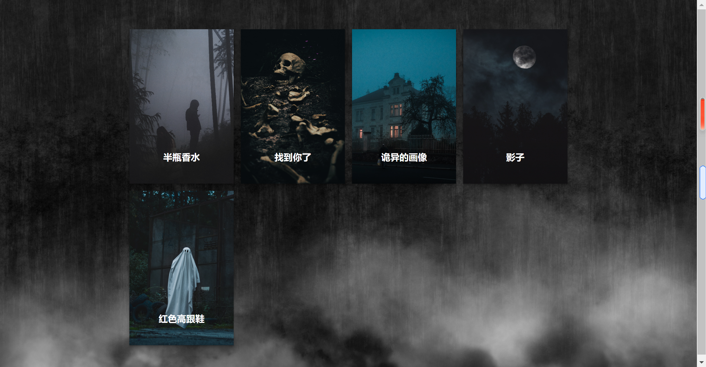
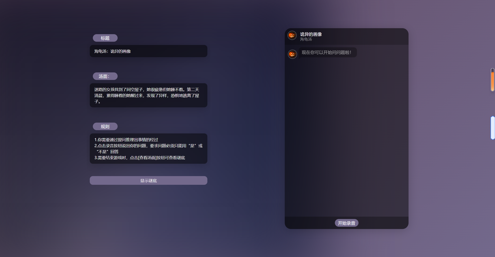
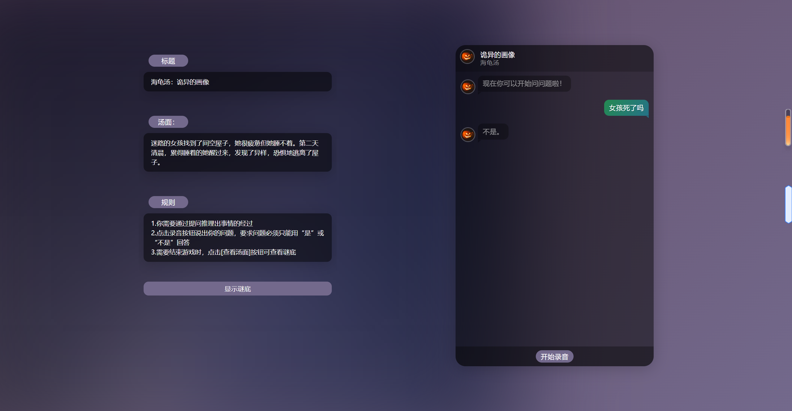
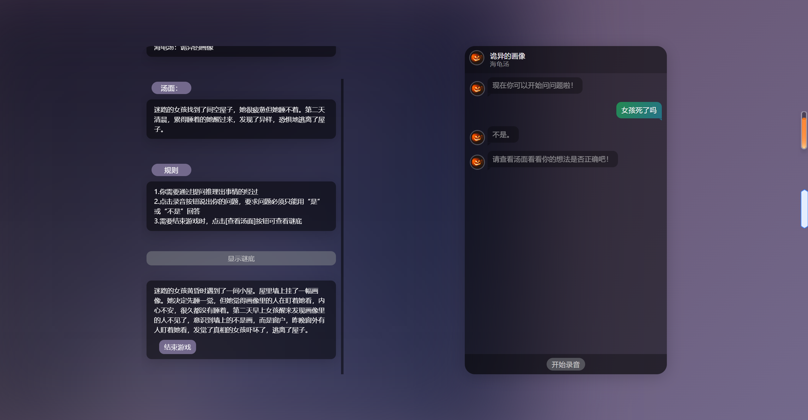

# 语音识别期末项目-海龟汤游戏

### 项目背景

海龟汤是情景谜题的俗称。情景谜题通常在一个小组中进行，其中一人主持谜题，其他人提问，只能回答“是”或“否”。当玩家中的一人能够复述主持人在心中构想的叙述时，谜题就解决了，特别是解释了最初情景中令人困惑的方面。

### 游戏方式

我们给出一段场景描述，玩家据此使用语音进行提问，我们对语音进行识别，调用chatgpt接口回答玩家问题，帮助玩家推理出该场景的真实情况。

### 项目亮点

- 精美的游戏画面
- 用户友好的交互性，包含键鼠、语音等多种方式
- AI的使用
- 创新性与商业价值

### 相关技术

- 本项目采用Flask框架进行Web开发，配合轻量级SQLite数据库进行数据管理。
- 调用ChatGPT API，动态适应各种主题和用户输入。
- 利用讯飞API进行语音转文本转换。

### 实际游戏画面

1. 开始界面：开始界面具有动态效果，用户点击任何位置进入游戏。

   

2. 主题选择：进入游戏后，用户可以根据自己的兴趣选择主题。

   

   鼠标悬停在主题卡片上显示主题详细信息。

   

3. 主题详情页面：选择主题后，用户可以进入主题详情页面。在该页面上，用户可以了解游戏规则和相关信息，包括如何提问、猜测谜底、操作汤面和访问问答界面。

   

4. 问答交互：当用户点击“开始录音”时，他们可以通过语音输入提问。系统将调用ChatGPT接口以“是”或“否”的格式提供答案。用户可以根据这些回答逐渐猜测谜底。

   

5. 查看谜底：用户点击“显示谜底”可以查看谜底是否与自己猜想一致。

   

